# EKS Cluster with Istio and Envoy Showcase

This project provides Terraform code to provision an Amazon EKS cluster and instructions to deploy Istio (which uses Envoy under the hood) along with a sample application to showcase traffic routing, observability, and security.

## Table of Contents

- [What are Istio and Envoy?](#what-are-istio-and-envoy)
- [Architecture & Traffic Flow](#architecture--traffic-flow)
- [1. Provision the Cluster](#1-provision-the-cluster)
  - [Option A: Clean Local Setup (Docker Desktop - Mac/Windows)](#option-a-clean-local-setup-docker-desktop---macwindows)
  - [Option B: Cloud Setup (Amazon EKS via Terraform)](#option-b-cloud-setup-amazon-eks-via-terraform)
- [2. Install Istio](#2-install-istio)
- [3. Deploy the Sample Application (Bookinfo)](#3-deploy-the-sample-application-bookinfo)
- [4. Expose the Application](#4-expose-the-application)
- [5. Showcase Istio & Envoy Functionality](#5-showcase-istio--envoy-functionality)
  - [A. Traffic Routing (Weight-based routing)](#a-traffic-routing-weight-based-routing)
  - [B. View Envoy Proxy Configuration](#b-view-envoy-proxy-configuration)
  - [C. Advanced Envoy Configurations (Bootstrap & Secrets)](#c-advanced-envoy-configurations-bootstrap--secrets)
  - [D. Dynamically Change Envoy Log Levels](#d-dynamically-change-envoy-log-levels)
  - [E. Check Envoy Sync Status](#e-check-envoy-sync-status)
  - [F. Native Envoy Commands (Admin API)](#f-native-envoy-commands-admin-api)
  - [G. View Envoy Access Logs](#g-view-envoy-access-logs)
  - [H. Traffic Management & Fault Injection Showcase](#h-traffic-management--fault-injection-showcase)
  - [I. Observability (Kiali, Jaeger, Prometheus, Grafana)](#i-observability-kiali-jaeger-prometheus-grafana)
- [6. Cleanup](#6-cleanup)
  - [Option A: Local Docker Desktop Cleanup](#option-a-local-docker-desktop-cleanup)
  - [Option B: AWS EKS Cloud Cleanup](#option-b-aws-eks-cloud-cleanup)
- [7. CI: Terraform Plan (optional, one-time AWS setup)](#7-ci-terraform-plan-optional-one-time-aws-setup)

## What are Istio and Envoy?

**Envoy** is a lightweight proxy. In this setup, one runs as a "sidecar" container inside every application pod, transparently intercepting all network traffic in and out of that pod -- the application itself doesn't need to know it's there. Because every request flows through a proxy, Envoy can do things like retries, timeouts, load balancing, mutual TLS, and detailed metrics/tracing without any application code changes.

**Istio** is the control plane that configures all those Envoy proxies. Instead of editing each proxy by hand, you declare desired behavior (routing rules, traffic splits, fault injection, security policies) as Kubernetes resources, and Istio's control plane (`istiod`) translates and pushes that configuration out to every Envoy sidecar via **xDS** -- a family of gRPC streaming APIs (e.g. *L*isteners, *R*outes, *C*lusters, *E*ndpoints Discovery Service, hence the "x") that Envoy was built to consume. In short: xDS is the wire protocol `istiod` uses to tell each Envoy proxy what listeners, routes, and upstream clusters it should have, and keep pushing updates as the mesh changes. Istio also deploys a dedicated Envoy instance as the **Ingress Gateway**, which is the entry point for traffic coming from outside the cluster.

Together: Envoy does the data-plane work (actually moving and inspecting traffic), Istio does the control-plane work (deciding what Envoy should do). The diagram below shows both in action.

## Architecture & Traffic Flow

The following diagram illustrates how the components interact in the cloud environment, from the user's initial request down to the individual components in the Bookinfo microservices.

[](docs/architecture.svg)

*Click the diagram (or [open it directly](docs/architecture.svg)) to view it full-size -- right-click / Cmd- or Ctrl-click to open it in a new tab. Source: [docs/architecture.mmd](docs/architecture.mmd).*

## 1. Provision the Cluster

You can choose to run this showcase entirely locally using Docker Desktop, or provision a cloud environment using AWS EKS.

### Option A: Clean Local Setup (Docker Desktop - Mac/Windows)

If you want to run this locally without AWS costs, you can use the Kubernetes cluster built into Docker Desktop.

1. Open **Docker Desktop**.
2. Go to **Settings (Gear icon)** -> **Kubernetes**.
3. Check **Enable Kubernetes** and click **Apply & Restart**.
4. Wait for the Kubernetes cluster to start (the K8s icon in the bottom left will turn green).
5. Ensure your terminal `kubectl` is pointing to the Docker Desktop local cluster:
   ```bash
   kubectl config use-context docker-desktop
   ```

*You can now skip directly to **Step 2 (Install Istio)**.*

### Option B: Cloud Setup (Amazon EKS via Terraform)

Navigate to the `terraform` directory and apply the configuration:

```bash
cd terraform
terraform init
terraform apply -auto-approve
```

Configure your local `kubectl` to connect to the new cluster:

```bash
aws eks --region $(terraform output -raw region) update-kubeconfig --name $(terraform output -raw cluster_name)
```

> **Security note:** By default the EKS API server's public endpoint is reachable from anywhere (`cluster_endpoint_public_access_cidrs = ["0.0.0.0/0"]` in `terraform/variables.tf`), which is convenient for this showcase but not appropriate for anything beyond a throwaway demo. Restrict it to your own IP/CIDR via `-var 'cluster_endpoint_public_access_cidrs=["YOUR_IP/32"]'` (or a `.tfvars` file) before applying in a shared or long-lived environment.

## 2. Install Istio

Download and install the Istio CLI (`istioctl`):

```bash
curl -L https://istio.io/downloadIstio | sh -
cd istio-*
export PATH=$PWD/bin:$PATH
```

Install Istio on the EKS cluster with the `demo` profile (good for showcasing):

```bash
istioctl install --set profile=demo -y
```

Label the default namespace to instruct Istio to automatically inject Envoy sidecar proxies when you deploy your application:

```bash
kubectl label namespace default istio-injection=enabled
```

## 3. Deploy the Sample Application (Bookinfo)

The Bookinfo app is a classic microservices example provided by Istio to showcase routing and Envoy proxies.

```bash
# Assuming you are still in the istio-* directory
kubectl apply -f samples/bookinfo/platform/kube/bookinfo.yaml
```

Verify the pods are running and have 2 containers each (the app container + the Envoy sidecar):

```bash
kubectl get services
kubectl get pods
```

## 4. Expose the Application

Deploy the Istio Ingress Gateway to allow external traffic into the mesh:

```bash
kubectl apply -f samples/bookinfo/networking/bookinfo-gateway.yaml
```

**If you are running on AWS EKS:**
```bash
export INGRESS_HOST=$(kubectl -n istio-system get service istio-ingressgateway -o jsonpath='{.status.loadBalancer.ingress[0].hostname}')
export INGRESS_PORT=$(kubectl -n istio-system get service istio-ingressgateway -o jsonpath='{.spec.ports[?(@.name=="http2")].port}')
export GATEWAY_URL=$INGRESS_HOST:$INGRESS_PORT

echo "Access the app at: http://$GATEWAY_URL/productpage"
```

**If you are running LOCALLY on Docker Desktop:**
Docker Desktop maps LoadBalancer services directly to your localhost.
```bash
export GATEWAY_URL=localhost:80

echo "Access the app at: http://$GATEWAY_URL/productpage"
```

## 5. Showcase Istio & Envoy Functionality

### A. Traffic Routing (Weight-based routing)

Route 50% of traffic to reviews v1 and 50% to reviews v3:

```bash
kubectl apply -f samples/bookinfo/networking/destination-rule-all.yaml
kubectl apply -f samples/bookinfo/networking/virtual-service-reviews-50-v3.yaml
```

### B. View Envoy Proxy Configuration

You can inspect the Envoy configuration generated by Istio for a specific pod using the `proxy-config` (or `pc`) wrappers:

```bash
# Get a reviews pod name
REVIEWS_POD=$(kubectl get pod -l app=reviews -o jsonpath='{.items[0].metadata.name}')

# View listeners, routes, clusters, and endpoints configured in Envoy
istioctl proxy-config listeners $REVIEWS_POD
istioctl proxy-config routes $REVIEWS_POD
istioctl proxy-config clusters $REVIEWS_POD
istioctl proxy-config endpoints $REVIEWS_POD
```

### C. Advanced Envoy Configurations (Bootstrap & Secrets)

Envoy receives its initial configuration from a bootstrap file and its TLS certificates via the Secret Discovery Service (SDS).

```bash
# View the initial bootstrap configuration loaded by Envoy
istioctl proxy-config bootstrap $REVIEWS_POD

# View the TLS certificates and secrets Envoy currently holds (crucial for mTLS debugging)
istioctl proxy-config secret $REVIEWS_POD
```

### D. Dynamically Change Envoy Log Levels

You can change Envoy's internal logging levels on the fly without restarting the pod—a very powerful feature for live debugging.

```bash
# Check current logging levels
istioctl proxy-config log $REVIEWS_POD

# Change the logging level for 'connection' and 'http' components to 'debug'
istioctl proxy-config log $REVIEWS_POD --level connection:debug,http:debug

# Reset logging levels back to the default ('warning')
istioctl proxy-config log $REVIEWS_POD --level warning
```

### E. Check Envoy Sync Status

Verify the synchronization status between the Istio Control Plane (istiod) and the Envoy proxies:

```bash
istioctl proxy-status
```

**Understanding "SUBSCRIBED TYPES" (xDS):**
When you run the command above, you will see a column listing subscribed types like `4 (CDS,LDS,EDS,RDS)`. These are the native **Envoy Discovery Service (xDS)** APIs that Envoy uses to fetch its configuration dynamically from Istiod:

*   **CDS (Cluster Discovery Service):** Defines the "clusters" (upstream services) that Envoy can route traffic to.
*   **EDS (Endpoint Discovery Service):** Provides the specific IP addresses (endpoints) of the pods backing the clusters defined in CDS.
*   **LDS (Listener Discovery Service):** Defines the ports Envoy listens on, and the network filters applied to incoming connections.
*   **RDS (Route Discovery Service):** Provides the HTTP routing rules (like the weight-based traffic split for Bookinfo) that map virtual hosts and paths to the clusters.

Notice that the `istio-egressgateway` only subscribes to `3 (CDS,LDS,EDS)` because it generally handles TCP/SNI routing or passthrough, meaning it doesn't need rich HTTP routing rules (RDS).

### F. Native Envoy Commands (Admin API)

If you want to bypass Istio and issue **native Envoy commands** directly, you interact with Envoy's Admin API (running on port `15000` inside the `istio-proxy` container).

You can run these native Envoy commands by executing `curl` directly inside the proxy container:

```bash
# View general Envoy server info and version
kubectl exec -it $REVIEWS_POD -c istio-proxy -- curl -s http://localhost:15000/server_info

# List all upstream clusters known natively to Envoy (format is: name::host::status)
kubectl exec -it $REVIEWS_POD -c istio-proxy -- curl -s http://localhost:15000/clusters

# List all native Envoy listeners
kubectl exec -it $REVIEWS_POD -c istio-proxy -- curl -s http://localhost:15000/listeners

# View Envoy internal metrics/stats (append ?filter=... to filter output)
kubectl exec -it $REVIEWS_POD -c istio-proxy -- curl -s http://localhost:15000/stats?filter=xds

# Dynamically change Envoy logging level via its native API (POST request)
kubectl exec -it $REVIEWS_POD -c istio-proxy -- curl -s -X POST http://localhost:15000/logging?level=debug

# Reset all Envoy statistical counters (POST request)
kubectl exec -it $REVIEWS_POD -c istio-proxy -- curl -s -X POST http://localhost:15000/reset_counters

# Dump the full native Envoy configuration JSON
kubectl exec -it $REVIEWS_POD -c istio-proxy -- curl -s http://localhost:15000/config_dump
```

**Alternative: Accessing the Envoy Admin UI in a Browser**

If you prefer a UI over the terminal, Istio provides a shortcut to port-forward the native Envoy Admin UI to your browser:

```bash
istioctl dashboard envoy $REVIEWS_POD
```

### G. View Envoy Access Logs

To see the traffic access logs from the Envoy sidecar proxy container:

```bash
# The -c flag (or --container) specifies the specific container within the Pod.
# Since Istio injects an Envoy proxy alongside the main app, each Pod has at least 2 containers.
# We must specify '-c istio-proxy' to read the logs of the Envoy container, rather than the app container.
kubectl logs $REVIEWS_POD -c istio-proxy
```

### H. Traffic Management & Fault Injection Showcase

Istio Envoy proxies allow you to simulate failures and control traffic distribution without changing application code.

**1. Inject an artificial delay (Fault Injection):**
Let's add a 7-second delay to the `ratings` service for a specific user (jason).
```bash
kubectl apply -f samples/bookinfo/networking/virtual-service-ratings-test-delay.yaml
```
*(Log in to the web UI as "jason" and notice the page load takes 7 seconds, then shows an error because the review service times out after 3 seconds – proving the proxy intercepted the traffic and injected the delay).*

**2. Shift traffic gradually (Canary Release):**
Let's route 50% of traffic to `reviews-v1` and 50% to `reviews-v3`:
```bash
kubectl apply -f samples/bookinfo/networking/virtual-service-reviews-50-v3.yaml
```
Refresh the browser multiple times. You will see the reviews switch roughly 50% of the time between having no stars (v1) and red stars (v3).

### I. Observability (Kiali, Jaeger, Prometheus, Grafana)

Istio makes it easy to visualize traffic distributions, trace request latency, and monitor metrics using telemetry data generated by the Envoy proxies.

**1. Install the observability addons:**

(Make sure you are in the `istio-*` directory)
```bash
kubectl apply -f samples/addons
```

Wait a few moments for the pods in the `istio-system` namespace (Prometheus, Grafana, Jaeger, Kiali) to be ready:
```bash
kubectl get pod -n istio-system
```

**2. Generate simulated traffic:**
To see meaningful data in the dashboards, we need background traffic.
```bash
# Send 100 requests to the Bookinfo app
for i in $(seq 1 100); do curl -s -o /dev/null "http://$GATEWAY_URL/productpage"; done
```

**3. Explore Kiali (Service Graph):**
Kiali visualizes the service mesh topology, showing real-time traffic flow, error rates, and security (mTLS) status.
```bash
istioctl dashboard kiali
```
*(In the Kiali UI, navigate to "Graph", select the "default" namespace, and under Display select "Traffic Distribution" and "Security").*

**4. Explore Grafana (Metrics):**
Grafana provides pre-configured dashboards for Istio out of the box, powered by Prometheus.
```bash
istioctl dashboard grafana
```
*(In Grafana, go to Dashboards -> Istio -> "Istio Mesh Dashboard" to view global request volumes, success rates, and latency.)*

**5. Explore Jaeger (Distributed Tracing):**
Jaeger lets you track a single request as it jumps across multiple microservices.
```bash
istioctl dashboard jaeger
```
*(In the Jaeger UI, select "productpage.default" under Service, and click "Find Traces". You can click into a trace to see exactly how many milliseconds Envoy spent routing between details, reviews, and ratings.)*

## 6. Cleanup

```bash
# Remove the sample app deployment and networking rules
samples/bookinfo/platform/kube/cleanup.sh

# Uninstall Istio and remove its namespace
istioctl uninstall -y --purge
kubectl delete namespace istio-system
```

### Option A: Local Docker Desktop Cleanup

If you used Docker Desktop, your cloud cleanup is effectively done. You can either leave the local Kubernetes cluster running empty, or turn it off:
1. Open **Docker Desktop**.
2. Go to **Settings** -> **Kubernetes**.
3. Uncheck **Enable Kubernetes** and click **Apply & Restart** (or click **Reset Kubernetes cluster** to wipe it completely).

### Option B: AWS EKS Cloud Cleanup

If you provisioned the EKS cluster via Terraform, make sure you destroy the cloud resources to avoid unexpected AWS charges:

```bash
cd ../terraform
terraform destroy -auto-approve
```

## 7. CI: Terraform Plan (optional, one-time AWS setup)

[.github/workflows/ci.yml](.github/workflows/ci.yml) always runs `terraform fmt -check` and `terraform validate` (no AWS access needed). It can also run `terraform plan` on every push to `main`, authenticating to AWS via short-lived OIDC credentials instead of long-lived secrets.

This requires a one-time bootstrap of an IAM role, defined in `terraform/github-oidc.tf`:

```bash
cd terraform
terraform apply \
  -target=aws_iam_role.github_actions_plan \
  -target=aws_iam_role_policy_attachment.github_actions_plan_readonly

terraform output -raw github_actions_role_arn
```

(The GitHub Actions OIDC provider itself is looked up via a data source rather than created, since it's a per-AWS-account resource -- if any other project in this account already set up GitHub Actions OIDC, a provider for `token.actions.githubusercontent.com` will already exist and trying to create a second one fails with `EntityAlreadyExists`.)

Then, in the GitHub repo settings (**Settings -> Secrets and variables -> Actions -> Variables**), add a repository variable named `AWS_ROLE_ARN` with that value. The next push to `main` will run the `plan` job; until `AWS_ROLE_ARN` is set, that job is skipped (the fmt/validate/typecheck jobs still run normally).

**Caveats:**
- The trust policy only allows `push` to `main` (not pull requests, including from forks) to assume the role, and the role only has `ReadOnlyAccess` -- it can't apply or destroy anything.
- No remote state backend is configured, so the CI plan starts from empty state on every run. It catches syntax/logic errors and confirms a plan succeeds, but it is not a true drift check against already-applied infrastructure. An S3 (or equivalent) backend would be needed for that.
